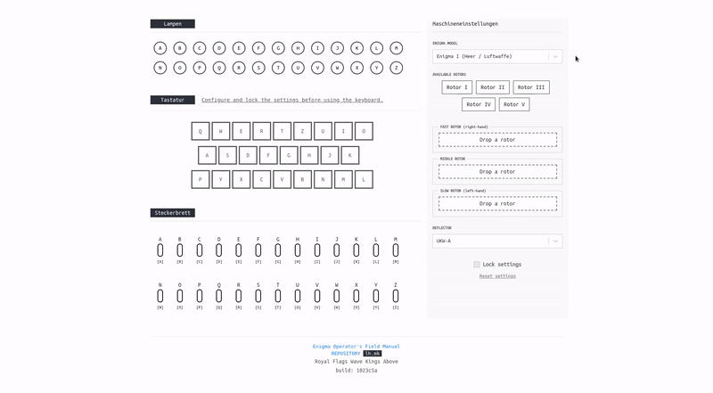

# enigma-emulator

Enigma machine emulator (https://enigma.lh.mk) for the Web. The emulator is faithful to the workings of the Enigma I, M3 and M4.

I highly recommend checking out the [Enigma Operator's Field Manual](https://github.com/lubeskih/enigma-simulator/blob/master/docs/EOFM.md) before using the emulator.

### Starting the emulator

##### Cloning the repository

`git clone https://github.com/lubeskih/enigma-emulator.git && cd enigma-emulator`

##### Installing required packages

`yarn install`

##### Running the emulator

`yarn start`

### Navigating around the repository

- `src` - Main source directory
- `src/components` - React components
- `src/constants` - Constant variables used around the project (e.g. Enigma wiring, turnovers etc...)
- `src/enigma-logic` - Files that hold the main logic behind the Enigma (stepping, turnover etc..) behind the rotors, reflectors, stators etc...
- `src/misc` - Misc
- `src/store` - MobX store files
- `src/types` - Interfaces/Types used in the project

### Contributing

Although I consider this project finished, contributions are more than welcome.

If you want to contribute, start with opening an issue before writing the code so we can first discuss the idea.

If everything goes well, you are free to open a PR, but please don't forget to include details about your changes.

### Reporting an issue

If you want to report an issue, please use GitHub's issue system.

### Contact

Drop me a line or two at `hristijan.lubeski@gmail.com`, phone would be easier if you have my number.

### License

This Enigma machine emulator is [MIT licensed](https://github.com/lubeskih/enigma-emulator/blob/master/LICENSE.md).
