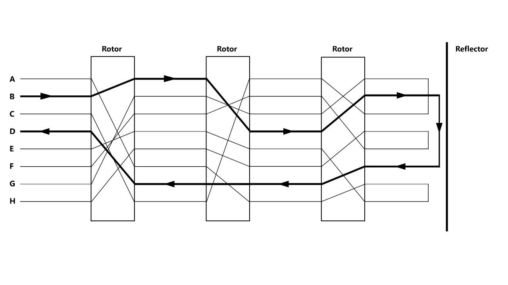

## Enigma Operator's Field Manual

##### Table of Contents

### Introduction

Welcome to the **Enigma Operator's Field Manual**. This manual purpose is to demystify the Enigma machine, the basics of the inner working of the machine, as well as operating it using a [computer simulator](https://enigma.lh.mk).

The simulator is faithful to the workings of the following Enigma models:

- `Enigma I` - used by the Heer (army) and the Luftwaffe (air-force).
- `Enigma M3` - used by the Wehrmacht (unified armed forces of Nazi Germany).
- `Enigma M4` - used by the Kriegsmarine (navy).

### Demystifying the Enigma

The Enigma machine is an electro-mechanical encryption device used by the Germans during World War II to transmit coded messages.

Ciphering was the necessary consequence of radio communications, which had to be used for aerial, naval, and mobile land warfare, and a radio message to one was a message to all. Virtually every German official radio communication was enciphered on the Enigma machine.

The basic Enigma machine had been exhibited in 1923, soon after its invention, at the congress of the International Postal Union. Originally, it was sold commercially and used by banks.

The German cryptographic authorities had modified it in a different way to create the machine which, though bearing the original name of Enigma, was much more effective than the comercially available device.

The underlying principle of an Enigma machine cipher is that of letter substitution, meaning that each letter of our plaintext (undeciphered message) is substituted by another letter.

It used electrical wirings to perform automatically a series of alphabetical substitutions. An Enigma machine would be used in a fixed state only for enciphering _one_ letter, and then the outermost (fast) rotor would move round by one place, creating a new set of connections between the input and the output.

That being said, the machine had only mechanised the basic operations of substitution and adding on, in such a way that a more complex system came within practical grasp. The Enigma did nothing that could not have been done by the looking up of tables in books, but enabled the work to be done more quickly and accurately.

The ciphers it produced were supposed to be unbreakable even by someone in possession of the machine.

##### The Basic Enigma

For the sake of simplicity, the diagram has been drawn for an alphabet of only eight letters, although in fact the Enigma worked on the ordinary 26-letter alphabet.

It shows the state of the machine at some particular moment in its use. The lines marked correspond to current-carrying wires.

|                                                                                                                                                                                                                                                                                   |
|:-----------------------------------------------------------------------------------------------------------------------------------------------------------------------------------------------------------------------------------------------------------------------------------------------------------------:|
| <small>*Current passing from the EKW, throughout the Rotors, reflecting itself at the UKW and back to a different path which ends up again, at the EKW.*  Found in [Andrew Hodges'](https://www.synth.co.uk/) book **Alan Turing: The Enigma**, digitalized by [Hristijan Lubeski](https://who.lh.mk).</small> |

A simple switch system at the input has the effect that if a key (say the B keys) is depressed, a current flows (as shown in the diagram by bold) lines and lights up a bulb in the output display panel (in this case, under the letter D). For the hypothetical 8-letter Enigma, the next state of the machine would be:

[NEXT STATE PICTURE]

##### Glossary of Technical Terms:

- `Tastatur` - Keyboard
- `Steckerbrett` - Plugboard
- `Grundstellung` - Ground / Initial settings
- `Ringstellung` - Ring settings
- `Maschineneinstellung` - Machine settings
- `Lampen` - Lamps
- `Walzenlage` - Wheel Order
- `Umkehrwalze (UKW)` - Reversing drum / Reflector Wheel
- `Stator / Entrittswalze (ETW)` - Static Wheel

### Enigma I

The `Enigma I` was developed around 1927/29 by Chriffrier­maschinen AG (later: Heimsoeth und Rinke) In Berlin (Germany) for the German Army (Reichswehr, later: Wehrmacht) 1 and introduced in 1932. [1]

Back to the simulator:
