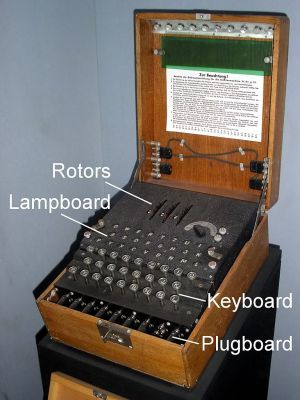
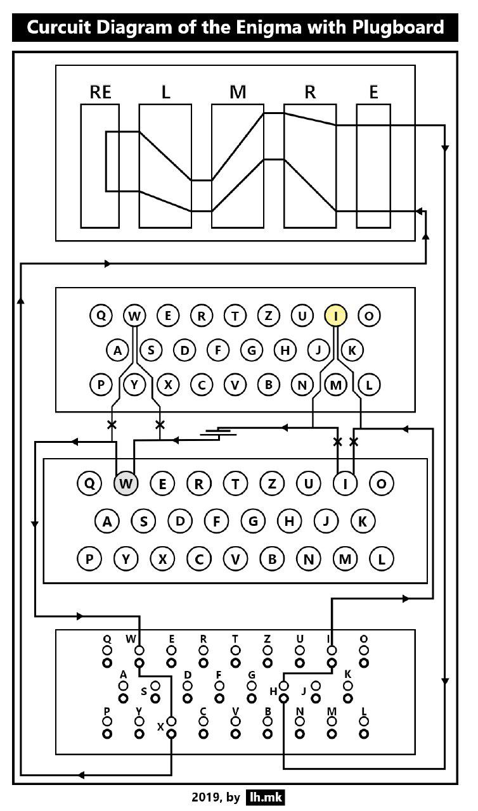
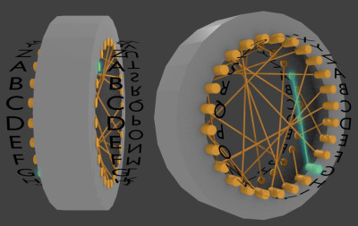
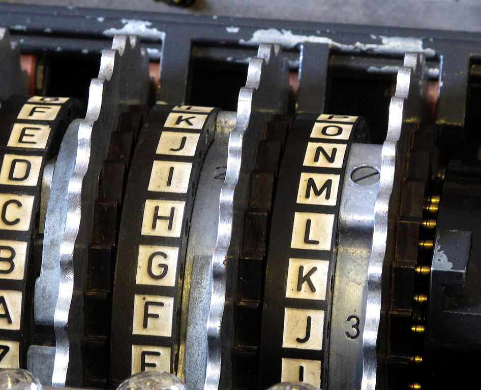
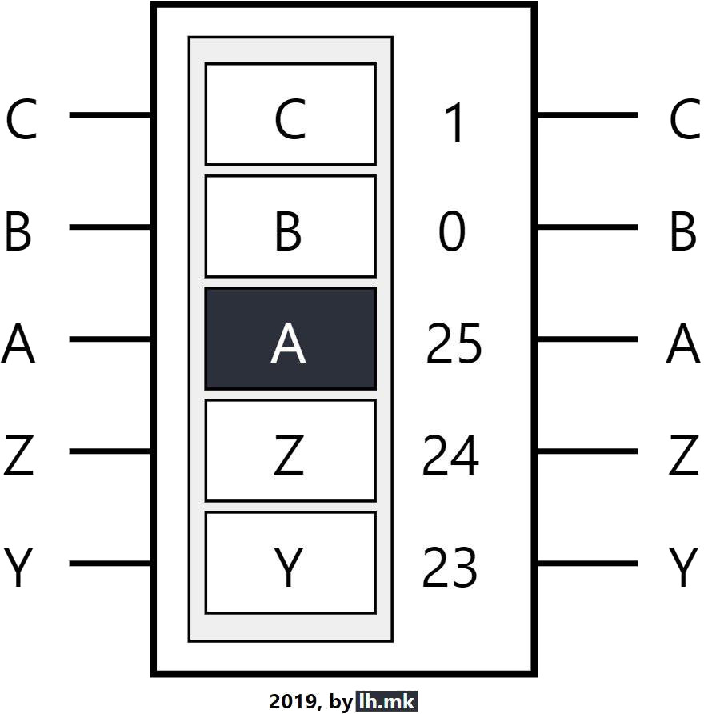
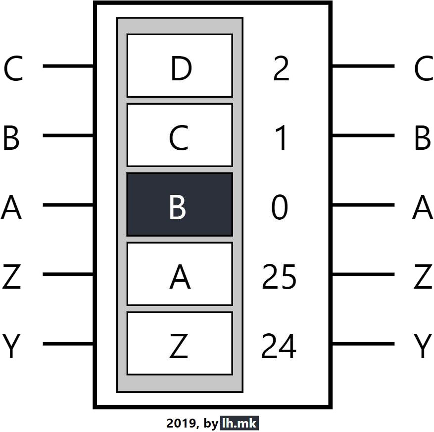
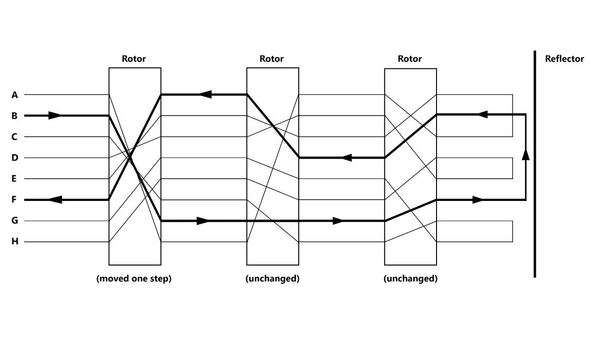
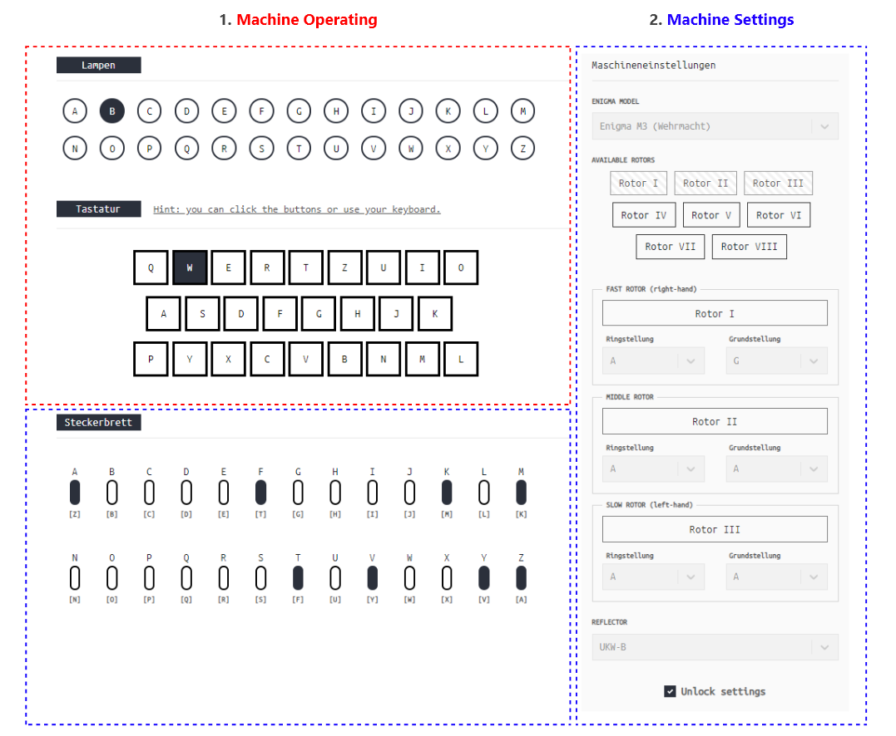
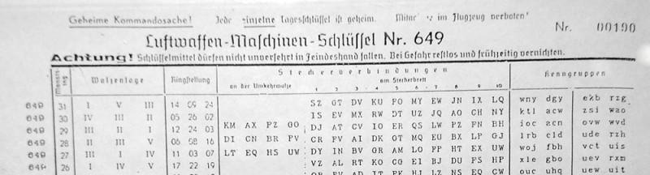

<h2 style="background-color: #2b303b; color: white; padding: 3px 5px 3px 5px; display: inline-block"> Enigma Operator's Field Manual </h2>

##### Table of Contents

- [Introduction](#introduction)
- [Demystifying the Enigma](#demystifying-the-enigma)
- [A Current's Path](#current-path)
  - [Keyboard](#keyboard)
  - [Plugboard](#plugboard)
  - [Entry Wheel](#entry-wheel)
  - [Rotors](#rotors)
  - [Reflector](#reflector)
  - [Reverse path](#reverse-path)
- [Operating the Enigma](#operating)
  - [Enigma Models](#models)
    - [Enigma I](#enigma-one)
    - [Enigma M3](#enigma-m3)
    - [Enigma M4](#enigma-m4)
  - [Understanding the Emulator](#understanding-the-simulator)
    - [Machine Settings](#machine-settings)
  - [Enciphering a Message](#eniphering)
    - [Space / Stop characters](#space-stop-chars)
    - [Encoding numbers](#encode-numbers)
  - [Deciphering Message](#decipher)
- [Glossary of Technical Terms](#glossary)
- [Other Enigma Simulators](#other-enigmas)
- [References](#references)
- [Dedications](#dedications)

> NOTE: If you are confused by some parts of this manual, please write me an email at: hristijan.lubeski@gmail.com, or open an issue at the [repository on GitHub](https://github.com/lubeskih/enigma-emulator). I will do everything I can to improve the manual and clear up any confusions.

> This manual is a collection of my attempts to explain the machine, alongside already published ones (check the References section), however, I drew the illustrations using Adobe XD.

<h3 style="background-color: #2b303b; color: white; padding: 3px 5px 3px 5px; display: inline-block">Introduction</h3>

Welcome to the **Enigma Operator's Field Manual**. This manual's purpose is to demystify the Enigma machine, uncover the inner working of the device, as well as provide clear instructions for operating it on a [computer emulator](https://enigma.lh.mk).

The emulator is faithful to the workings of the following Enigma models:

- `Enigma I` - used by the Heer (army) and the Luftwaffe (air-force).
- `Enigma M3` - used by the Wehrmacht (unified armed forces of Nazi Germany).
- `Enigma M4` - used by the Kriegsmarine (navy).

<h3 style="background-color: #2b303b; color: white; padding: 3px 5px 3px 5px; display: inline-block">Demystifying the Enigma</h3>

The Enigma machine is an electro-mechanical encryption device used by the Germans during World War II to transmit coded messages.



> Picture of an Enigma machine stolen from the Internet.

Ciphering was the necessary consequence of radio communications, which had to be used for aerial, naval, and mobile land warfare, where a radio message to one was a message to all. Virtually every German official radio communication was enciphered on the Enigma machine.

The basic Enigma machine had been exhibited in 1923, soon after its invention, at the congress of the International Postal Union. Originally, it was sold commercially and used by banks.

The German cryptographic authorities had modified it in a different way to create the machine which, though bearing the original name of Enigma, was much more effective than the commercially available device.

The underlying principle of an Enigma machine cipher is that of letter substitution, meaning that each letter of a plaintext (undeciphered message) is substituted by another letter.

It used electrical wirings to perform automatically a series of alphabetical substitutions. An Enigma machine would be used in a fixed state only for enciphering _one_ letter, and then the outermost (fast) rotor would move round by one place, creating a new set of connections between the input and the output.

For any Enigma, in any state, it would be true if `A` were enciphered into `E`, then in that same state, `E` would be enciphered as `A`. The substitution alphabets resulting from an Enigma state would always be _swappings_. However, the Enigma was associated with a grave weakness, in that the substitutions thus performed were always of this very special kind, with the particular feature that **no letter could ever be enciphered into itself**.

The receiver of the message had only to set up the machine in exactly the same way as the sender, and feed in the cipher-text, to recover the plain-text.

That being said, the machine had only mechanized the basic operations of substitution, in such a way that a more complex system came within practical grasp. The Enigma did nothing that could not have been done by the looking up of tables in books, but enabled the work to be done more quickly and accurately.

In all cipher systems one assumes that the message has been intercepted. The objective is then to make it impossible, or at any rate very difficult and time-consuming, for the interceptor to decrypt the message. The ciphers it produced were supposed to be unbreakable even by someone in possession of the machine.

<h3 style="background-color: #2b303b; color: white; padding: 3px 5px 3px 5px; display: inline-block">A Current's Path</h3>

When a button is depressed on the Enigma, a current, typically from a battery, starts its journey throughout the mechanical parts of the encryption device. The following paragraphs and illustrations represent/illustrate the current's path in order. The first stop is at the Keyboard. Take a moment to look at this circuit diagram before moving on.

<figure>
    </img>
    <br>
</figure>

```
RE - Reflector
L - Left-hand rotor
M - Middle rotor
R - Right-hand rotor
E - Entry-wheel / Stator
```

#### Keyboard

While the keyboard does not seem to do some complicated work when enciphering a letter, it actually does the most important work. When a key on the keyboard is pressed, one or more rotors move to form a new rotor configuration which will encode one letter as another. Keep in mind that the outermost rotor steps **before** current starts flowing through it.

#### Plugboard

The plugboard is similar to an old-fashioned telephone switch board that has ten wires, each wire having two ends that can be plugged into a slot. Each plug wire can connect two letters to be a pair (by plugging one end of the wire to one letter’s slot and the other end to another letter). The two letters in a pair will swap over, so if `A` is connected to `Z`, `A` becomes `Z` and `Z` becomes `A`. This provides an extra level of scrambling for the military.

#### Entry Wheel

The current entry wheel connects the plugboard to the rotor assembly. If the plugboard is not present, the entry wheel instead connects the keyboard and lampboard to the rotor assembly. The military Enigma connects the keys in straight alphabetical order: `A => A`, `B => B` and so on. The static rotor simply turns wires into contacts.

#### Rotors



> Illustration of an Rotor, also, stolen from the Internet.

The rotors are the heart of the Enigma machine. Each rotor is a disc, which has an electrical contact pins arranged in a circle on one face; and circular plates (electrical contacts) on the other (the pins and contacts represent the alphabet — typically the 26 letters A–Z).

When the rotors are mounted side-by-side on the spindle, the pins of one rotor rest against the plate contacts of the neighboring rotor, forming an electrical connection.

Inside the body of the rotor, 26 wires are randomly connected each pin on one side to a contact on the other. This is where the 'magic' happens, which is why the rotors are also called 'scramblers'.

##### Ring-settings (Ringstellung):



> Enigma rotors with Alphabetical rings. Picture stolen from the Internet.

The rotors had to be marked in some way on the outside so that the different positions could be identified. However, here entered yet another element of complexity. Each rotor was encircled by a ring bearing the 26 letters, so that with the ring fixed in position, each letter would label a rotor position (In fact, the letter would show through a window at the top of the machine).

However, the position of the ring, relative to the wirings, would be changed each day. The wirings might be thought of as labelled by numbers from 1 to 26, and the position of the ring by the letters A to Z appearing in the window. So a ring-setting would determine where the ring was to sit on the rotor, with perhaps the letter G on position 1, H on position 2, and so forth (see the illustrations bellow).

Since the rotation of a rotor is triggered by a ratchet and pawl mechanism, every time a key is depressed, one or more rotors rotate by one place.

As this ring rotated with its rotor, a notch machined into it would eventually align itself with the pawl, allowing it to engage with the ratchet, and advance the rotor on its left.

The advancement of a rotor other than the left-hand one is called a _turnover_.

It is important to keep in mind that the ring setting only affects the wiring, it doesn't affect the turnover which still happens at the same letters.

##### Ground-settings (Grundstellung):

The ground-settings tells the operator of the machine what position the rotors should be in when setting up the machine (the letters you see in the little windows). So, for example, if the ground-setting for the left-hand rotor is `A`, you should see the letter `A` at the left-hand little window of the machine.

###### Calculating the offset from the Ring/Ground settings

When you put the Rotor on the spindle, in any position, you create an `OFFSET`. The `OFFSET` is important so you would know how to calculate the entry/exit point of the current that flows through the Rotor.

When the Rotor's `Ring-setting` is set to `1` (which also can be represented as: `A`), and the `Ground-setting` is set to `A` (which also can be represented as: `1`), the `OFFSET` is `0`, since the `Ring-setting` and the `Ground-setting` are aligned.

Here's a basic illustration of the `Ground-setting` and the `Ring-setting` of a Rotor below. Keep in mind that the illustrations represent`A` as `0`, `B` as `1`... `Z` as `25`, and **NOT** `A` as `1`, `B` as `2` ... `Z` as `26`.

In the first illustration, the `Ring-setting` is set to `0`, and the `Ground-setting` is set to `A`.

**NOTE**: You actually see the **`Ground-setting`** through the little window, in this case the rectangle with dark background.


When we have set the `Ring-setting` to `0` and the `Ground-setting` to `A` (which also can be represented as `0`), the `OFFSET` of the Rotor would be `groundSetting - ringSetting`, in this case: `0`.

This means, if we depress a button (and for the sake of this argument, let's say that the Rotor/s would **NOT** step after depressing a button), the current would flow throughout the Rotors that have **NO OFFSET**, so if I press `A`, it will enter the Rotor in the `0th` position, and exit at whatever wire might be connected to the `0th` position on the other side. But we know that when we depress a button, the right-most Rotor steps **BEFORE** current starts flowing, so it creates an `OFFSET`, meaning: this time when we press `A`, it will enter the Rotor at position `currentRotorPosition + 1 = 1`.

On the second illustration, the `Rotor` has it's `Ring-setting` set to `1` (`B`), but the `Ground-setting` is on `A` (`0`), so you basically see `A` through the little window, but now the offset is **NOT** `0`!

We can still calculate the offset as: `OFFSET = groundSetting - ringSetting = -1`, and IF `OFFSET < 0`, `OFFSET = 26 - | OFFSET | = 25`.



Now, we still have the `Ring-setting` set to `1` (`B`), but we also want to see `B` (`1`) through the little window. By doing this, we align the `Ring-setting` and the `Ground-setting`, making the offset `0`, which will be the **SAME** with the first illustration.



##### Basic Enigma:

For the sake of simplicity, the diagram has been drawn for an alphabet of only eight letters, although in fact the Enigma worked on the ordinary 26-letter alphabet.

It shows the state of the machine at some particular moment in its use. The lines marked correspond to current-carrying wires.

<figure>
    </img>
    <center>
    <small><i>Current passing from the Entry-wheel, throughout the Rotors, reflecting itself at the Reflector and then going back to a different path which ends up again, at the Entry-wheel.</i><br><br> <i>Found in <a href="">Andrew Hodges'</a> book <strong>Alan Turing: The Enigma</strong>, digitalized by <a href="https://lh.mk">lh.mk</a></i>.</small>
    <center>
    <br>
    <br>
</figure>

A simple switch system at the input has the effect that if a key (say the B key) is depressed, a current flows (as shown in the diagram by bold) lines and lights up a bulb in the output display panel (in this case, under the letter D). For the hypothetical 8-letter Enigma, the next state of the machine would be:

<figure>
    </img>
    <center>
    <small><i>Current passing from the Entry-wheel, throughout the first rotor who's path just change, throughout the rest of the rotors, reflecting itself at the Reflector and then going back to a different path which ends up again, at the Entry-wheel.</i><br><br> <i>Found in <a href="">Andrew Hodges'</a> book <strong>Alan Turing: The Enigma</strong>, digitalized by <a href="https://lh.mk">lh.mk</a></i>.</small>
    <center>
    <br>
</figure>

#### Reflector

The reflector is the disc that can be found next (on the left side) to the left-most rotor. As it's name says, it reflects back the received electrical current. It basically connects outputs of the last rotor in pairs redirecting current back through the rotors by a different route.

The reflector ensured that Enigma would be **self-reciprocal**; thus, with two identically configured machines, a message could be encrypted on one and decrypted on the other. The reflector also gave Enigma the property that no letter ever encrypted to itself.

#### Reverse Path

After the reflector reflects the electrical current, the current goes back into the rotors (but now takes a different path), back into the entry wheel and ends up lighting one of the lamps.

<h3 id="operating" style="background-color: #2b303b; color: white; padding: 3px 5px 3px 5px; display: inline-block">Operating the Enigma</h3>

#### Enigma Models

It is important to know that the Enigma was a family of electro-mechanical encryption machines and not just one device.

This manual covers the Enigma I, Enigma M3 and Enigma M4.

##### Enigma I

The Enigma I was used by both the Heer (Army) and the Luftwaffe (Air Force). It was later also adopted by the Kriegsmarine (German Navy) where it became known as the M1, M2 and finally the M3.

The only obvious difference between the Army version and the Navy version is that the wheels of the latter have letters (A-Z) rather than numbers.

Slightly before the beginning of the WWII, the machine was supplied with five coding wheels, that could be inserted in any of 60 possible orders (5 x 4 x 3).

More details about the Enigma I can be found [here](https://www.cryptomuseum.com/crypto/enigma/i/).

##### Enigma M3

Enigma M3 was a 3-wheel electro-mechanical cipher machine, used during WWII by the German Wehrmacht.

The M3 machine uses three wheels (out of a selection of eight) and a reflector (a choice of two, "B" or "C").

Initially, the M3 was supplied with five cipher wheels that were wired identically to the five wheels of the Wehrmacht's Enigma I. This way, they were able to exchange messages with the Heer and Luftwaffe. In 1939 however, three more wheels were added — VI, VII and VIII — which were used exclusively by the Kriegsmarine. They were not supplied to the rest of the German Army.

The M3 is functionally identical to the compatible Enigma I that was used by the Heer and Luftwaffe. Nevertheless there are a couple of manufacturing differences that are unique to the Kriegsmarine machines. So far, the following differences have been recorded:

- Letters on the wheels rather than numbers
- Different ring setting mechanism
- Separate lamp panel (hinged on the M2)
- Lockable wheel cover with two locks
- Removable top lid (of the wooden case)
- Plugs with longer pins (incompatible with Enigma I plugboard)
- Lock in top lid of wooden case rather than in the flap at the front
- Two grips at the sides (for pulling the machine out of a bay)
- 6V circular power socket (M1, M2), or two sockets for 4V and 220V (M3)

More details about the Enigma M3 can be found [here](https://www.cryptomuseum.com/crypto/enigma/m3/index.htm).

##### Enigma M4

The Enigma M4 was developed during the WWII, for use by certain divisions of the Kriegsmarine (German Navy) — in particular for the U-Boats. It was intended as a more secure version of the Enigma M3. It was supplied with 8 different coding wheels, (marked I to VIII), three of which were in the machine at any given time.

Besides 3 more wheels to choose from, an extra wheel – or Zusatzwalze – was added to the M4, to the left of the three regular wheels. This extra wheel adds an additional stage to the encryption algorithm. The extra wheel does not move when entering a message and is not interchangeable with the other wheels. When the extra wheel is placed at position A, the machine is backwards compatible with the 3-wheel Enigma I and the Enigma M3.

Two different versions of the extra wheel are known: Beta and Gamma.

**Note**: The three extra wheels (VI, VII and VIII) have two notches each, which causes a more frequent wheel turnover and less regular stepping.

More details about the Enigma M4 can be found [here](https://www.cryptomuseum.com/crypto/enigma/m4/index.htm).

#### Understanding the Emulator

The emulator can be divided in two parts:

- Machine Operating
- Machine Settings



##### Machine Settings

Every Enigma operator was provided with a code book which he consulted at midnight which was when the new key for that day came into effect.

The code book listed the five parameters for setting up the Enigma:

1. The `Datum` or date.
2. The `Walzenlage` or rotor order for that date. For example: `IV, I, V`.
3. The `Ringstellung`, or ring setting for that date. For example: `23 02 17`.
4. The `Steckerverbindungen` or plugging for that date. For example: `AR KT MW LC XD EJ ZB UY PS HN`.
5. The `Kenngruppen`, or discriminant for that date. For example: TXM.



> German Air Force Enigma key list with reconfigurable reflector. Picture stolen from the Internet.

Don't worry if you don't have a code-book. You can think of some random settings, but don't forget to write them down. Read more about the code-book [here](http://users.telenet.be/d.rijmenants/en/enigmaproc.htm).

Configuring the machine:

1. Choose an Enigma machine model. The emulator defaults to the `Enigma I`. Selecting an Enigma machine model can be done through the select field on the right side, under the `Maschineneinstellungen` (Machine settings) section. You can choose between the `Enigma I`, `Enigma M3` or `Enigma M4`.

2. After choosing an Enigma model, under the `Enigma Model` section you can see the `Available Rotors` section, which lists the available rotors for that particular model. In the picture above, you can see that the `Enigma M3` is selected, meaning that there are 8 different available rotors to choose from.

3. Once you choose which rotors you would want to use, drag-and-drop them one by one into the three possible droppable positions. The first droppable position is for the `FAST ROTOR (right-hand)`, the second is for the `MIDDLE ROTOR` and the third of the `SLOW ROTOR (left-hand)`.

4. Next, according to this example, you would take `rotor IV` and set its `Ringstellung` to `23 (W)`. Repeat this process with `rotor I`, setting its ring in the `02 (B)` position and with `rotor V`, setting its ring in the `17 (Q)` position.

5. After setting up the rotors, you will need to choose a reflector, which also, depends on the model.

6. Next, set the steckerboard (plugboard) by plugging A to R, then K to T, then M to W, and so on.

7. Now you need to think of three letters at random, say RNF, for the Grundstellung or indicator-setting. After that, manually rotate the left rotor (set the ground-settings) until it shows R, the middle rotor until it shows N and the right rotor until it shows F uppermost.

8. Proceed with locking the settings by checking the `lock settings` checkbox.

9. Next, think of another three letters at random, say JRM, for the message-setting. Then, press the J key, and Q, say, would light up, then press R, and F, say, would light up, next you should press M, and L, say, would light up. Normally, your assistant would make a note of the enciphered message-setting (QFL in this example). But, to spare you some time, there are cipher logs on the bottom of the emulator which does this for you. After this, unlock the settings, set the rotors to JRM and then lock them again.

The Enigma is now set for enciphering or deciphering.

#### Enciphering a Message

To encipher a message, you need to key-in the plaintext of the message, which will result in a cipher-text output.

##### Space / Stop / Comma ...

- KLAM = Parenthesis
- ZZ = Comma
- X = Full stop (end of sentence)
- YY = Point or dot
- X`*****`X = Inverted commas

##### Encoding numbers

Encoding numbers was solved with using a number code, with the top row of letters representing the numbers from one to nine, and the letter `P` representing zero.

To include numbers in your message, you first need to indicate that you are about to use a number by entering the letter `Y` before each number. So, to encode the number 5 in your message you would type in `YT`, the number 6 would be `YZ`, and 42 would be `YRW`.

When you are receiving a message, if your decoded text has a series of seemingly indecipherable characters, like `YQRT X YYE` you know that the `Y` indicates the start of a number and the proceeding letters correspond to those numbers. The `X` is the stop character.

Sometimes, numbers were written out as `NULL EINZ ZWO DREI VIER FUNF SEQS SIEBEN AQT NEUN`.

###### Notes

- Typically, a complete transmission would include the sender's and receiver's call-signs, frequency, signal strength, readability, intercept station number, time of origin, urgency, number of parts in the signal, number of current part, number of letters in current part, Kenngruppe discriminant (to state which key was being used - TXM in this example) and Grundstellung (RNF in this example). This was all transmitted en clair and followed by the enciphered message-setting (QFL in this example), the enciphered message and finally the end of message signal.

- To improve security it was an operational rule that no message should exceed 250 letters.

- Prior to 1st May 1940, in order to reduce errors, the procedure was to repeat the encipherment of the message setting, so in this example, JRMJRM yields, say, BKTRFQ. This repeated encipherment of the message-setting was both foolish and unnecessary. The Poles' exploitation of it by analytically comparing the first triplet QFL to the second triplet RFQ, enabled them to break Enigma. On 1st May 1940 the Germans abandoned repeated message-settings after which the Poles' techniques were useless.

#### Deciphering a Message

To decipher a message, the receiver should set up his Enigma in accordance with the key for the day, turn his rotors to the Grundstellung (RNF in this example) and key-in the enciphered message-setting (QFL in this example). Keying-in QFL would yield JRM so the operator would reset the rotors on his Enigma to JRM and then key in the cipher-text, his assistant would read off and record the plaintext as each letter was illuminated.

###### Notes

- Prior to 1st May 1940 the operator would key-in the first six letters of the ciphertext, to yield, in this example, JRMJRM. He would then reset the rotors to JRM and key in the remainder of the cipher-text as above.

##### Glossary of Technical Terms:

- `Tastatur` - Keyboard
- `Steckerbrett` - Plugboard
- `Grundstellung` - Ground / Initial settings
- `Ringstellung` - Ring settings
- `Maschineneinstellung` - Machine settings
- `Lampen` - Lamps
- `Walzenlage` - Wheel Order
- `Umkehrwalze (UKW)` - Reversing drum / Reflector Wheel
- `Stator / Entrittswalze (ETW)` - Static Wheel
- `Zusatzwalze` - Extra Wheel
- `Datum` - Date

##### Other Enigma Simulators

- [Louise Dade's Enigma Emulator](http://enigma.louisedade.co.uk/)
- [Tom MacWright's Enigma Emulator](https://observablehq.com/@tmcw/enigma-machine)

##### References

- **Alan Turing: The Enigma** by [Andrew Hodges](https://www.synth.co.uk/).
- [Louise Dade's Enigma Emulator Help](http://enigma.louisedade.co.uk/help.html)
- [Enigma Cipher Machines - Crypto Museum](https://www.cryptomuseum.com/crypto/enigma/)
- [Enigma machine - Brilliant](https://brilliant.org/wiki/enigma-machine/)
- [Enigma machine - Wikipedia](https://en.wikipedia.org/wiki/Enigma_machine)
- [Enigma machine - Codes and Ciphers](https://www.codesandciphers.org.uk/enigma/enigma1.htm)
- [Ellsbury - The Enigma machine - Its Construction, Operation and Complexity](http://www.ellsbury.com/enigma3.htm)
- [THE ENIGMA ENIGMA: HOW THE ENIGMA MACHINE WORKED](https://hackaday.com/2017/08/22/the-enigma-enigma-how-the-enigma-machine-worked/)

##### Dedications

I dedicate this software to the Internet. Have fun using it as I had fun writing it!

Also, a big **THANK YOU!** to:

- Simon (who actually built his own 3D printed Enigma machine -- check out his YouTube channel [here](https://www.youtube.com/channel/UCJqzEbh1UOpZJj3Hrv2mPZA)) from [asciimation.net](http://www.asciimation.co.nz/), for clearing up my confusion between the `Grundstellung` and the `Ringstellung`.

- My friend [Andrej Trajchevski](https://andrejt.com/), who actually bought me Andrew Hodge's book **Alan Turing: The Enigma**, which I really enjoyed and later used it for writing some parts of this manual.

- My friend [Nikola Demerdziev](https://github.com/newkdukem), he knows why. :)
